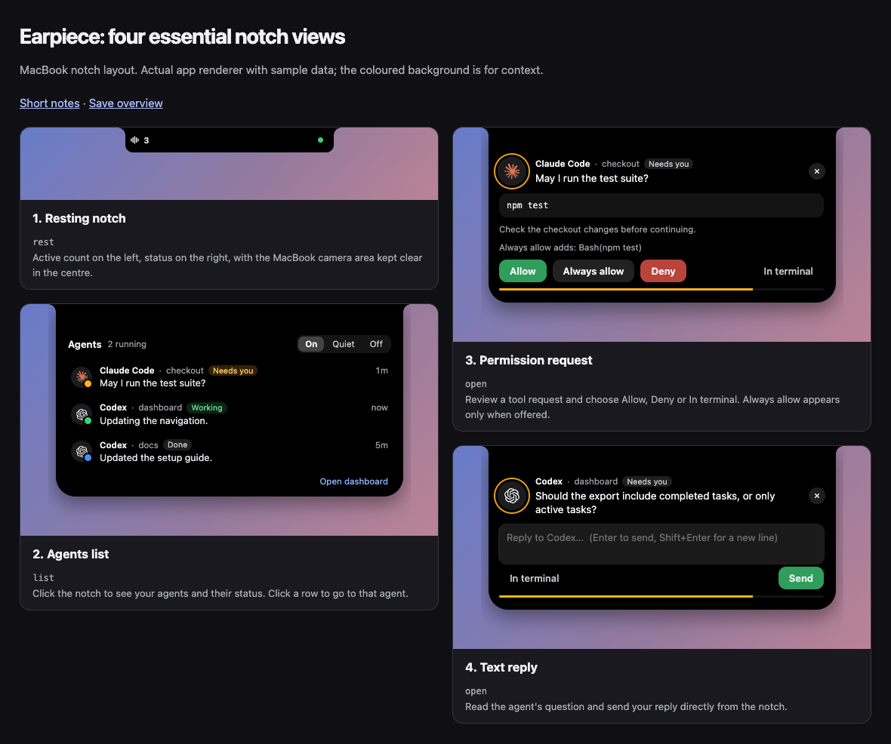

# Four essential notch views

[View the screenshots](notch-states/index.html) · [Overview image](notch-states/overview.png)

This reference keeps the four views that matter day to day. All use the **MacBook notch layout**: a wide centre reserved for the camera, with the count and status in the wings. Captures use the real app renderer with sample data.

| View | Purpose | Action |
| --- | --- | --- |
| **1. Resting notch** | See the active count and status at a glance. | Click to expand. |
| **2. Agents list** | See active/recent agents and what they are doing. | Click a row to jump to the agent, or open the dashboard. |
| **3. Permission request** | Review a command the agent wants to run. | Allow, Deny, or In terminal. Always allow appears only when supported and offered. |
| **4. Text reply** | Answer an agent's question. | Type a reply and press Send or Enter. |



**Interaction notes**

- Click expands; hover keeps the panel open.
- Requests first attract attention in the collapsed notch. Click to open them.
- Permission and reply controls require **General → Answer from the card** and supported agent hooks. The setting is off by default.
- Permission buttons become available 700 ms after opening. Nothing is approved by hovering.
- The list shows up to six active/recent sessions; Open dashboard gives the broader inventory.
- Quiet, errors, sending and confirmations are variations of the UI, rather than additional entries in this reference.

**Corner correction**

The popup window now disables native rounded corners so macOS does not cut into its own concave top curves. The renderer's left and right curves are checked for symmetry. The updated app must be restarted to recreate the native window; a fresh native screenshot remains the final check for the reported gap.

Recorded October 3, 2026. Recreate these four captures from the repository root:

```bash
app/node_modules/.bin/electron scripts/capture-notch-states.mjs
```
